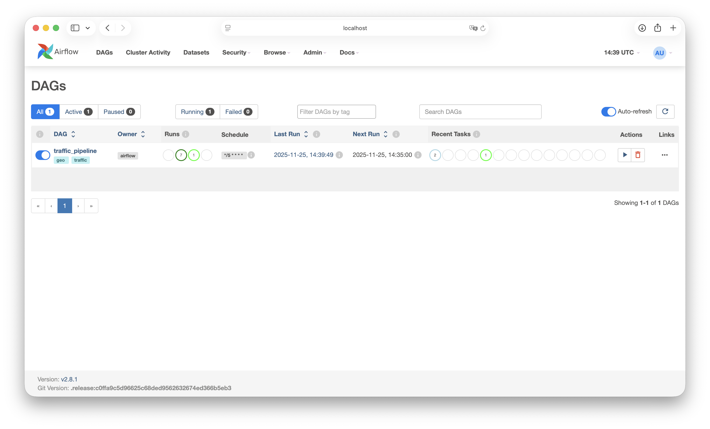
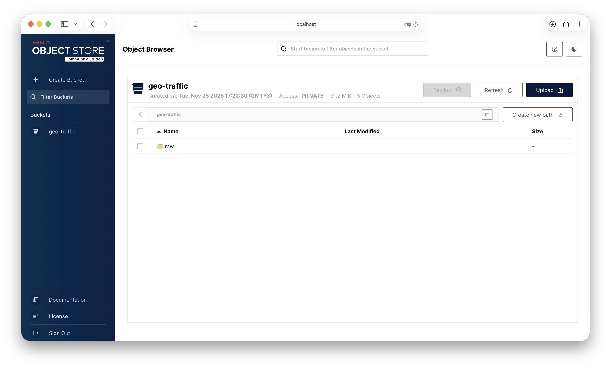
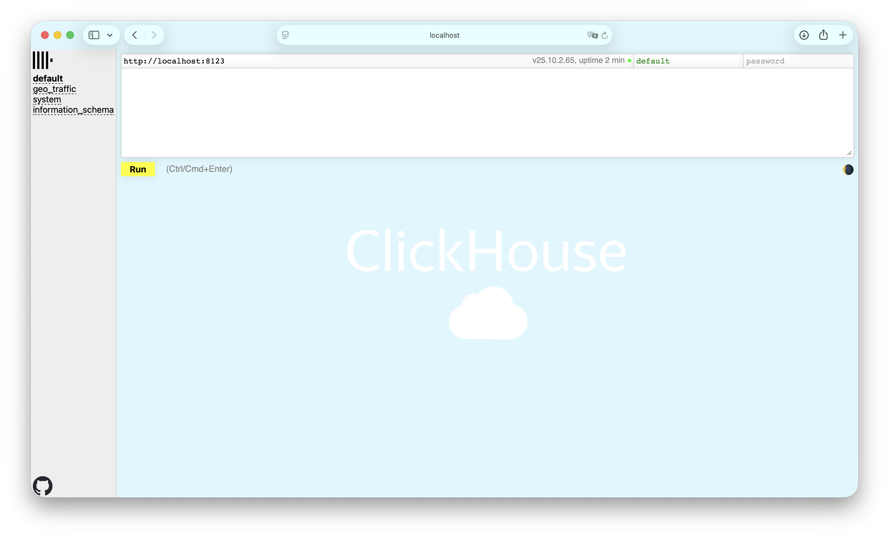
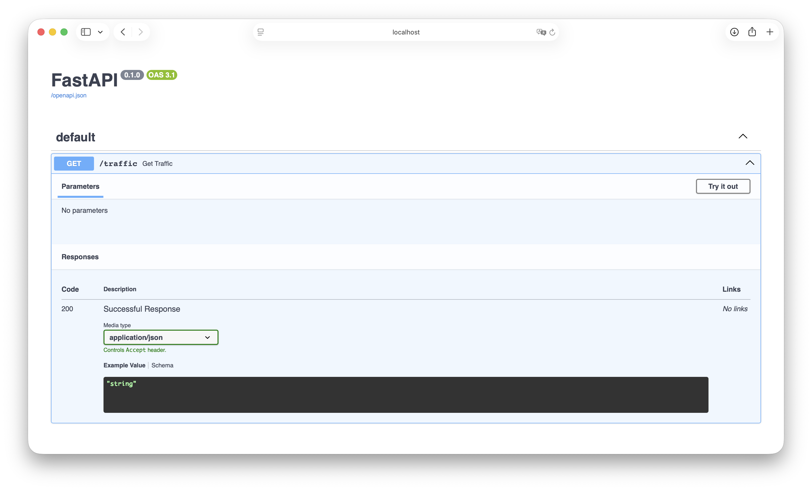
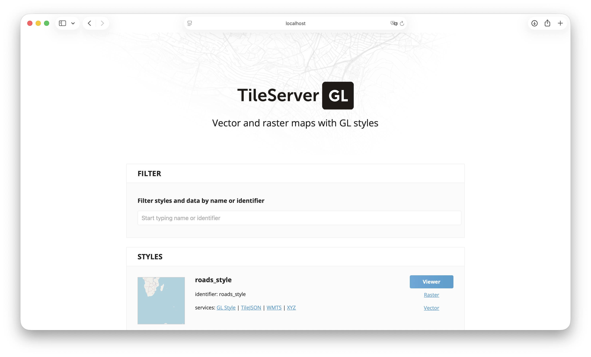

# 🗺️ Geo Traffic – Система мониторинга трафика Москвы

> **Интерактивная карта трафика в реальном времени** с автоматической генерацией данных, хранением в аналитической БД и
> визуализацией на карте

---

## 🎯 Описание проекта

**Geo Traffic** — это полнофункциональная система мониторинга и визуализации дорожного трафика в Москве. Система
автоматически генерирует данные о трафике, сохраняет их в хранилище и отображает на интерактивной карте с цветовой
индикацией пробок.

### Основные возможности ✨

- 🤖 **Автоматическая генерация** данных о трафике каждые 5 минут
- 💾 **Хранение данных** в ClickHouse для аналитики
- 📦 **Архивирование** сырых данных в MinIO (S3-совместимое хранилище)
- 🗺️ **Интерактивная карта** с цветовой индикацией пробок
- 🔄 **Обновление в реальном времени** данных на карте
- 📊 **Масштабируемая архитектура** на базе Docker

---

### Технологический стек

- **Оркестрация:** Apache Airflow 2.8.1
- **Базы данных:** ClickHouse (аналитика), PostgreSQL 13 (метаданные)
- **Хранилище:** MinIO (S3-совместимое)
- **Backend:** FastAPI (Python 3.10)
- **Frontend:** MapLibre GL JS, HTML5/CSS3
- **Карты:** TileServer GL, MBTiles
- **Контейнеризация:** Docker, Docker Compose

---

## 🏗️ Архитектура системы

```
┌─────────────────────────────────────────────────────────────────┐
│                        Geo Traffic System                       │
└─────────────────────────────────────────────────────────────────┘

┌─────────────┐     ┌──────────────┐     ┌──────────────┐
│   Airflow   │────▶│   Generator  │────▶│ traffic.json │
│  Scheduler  │     │              │     │              │
└──────┬──────┘     └──────────────┘     └──────────┬───┘
       │                                            │
       │                                            │
       ├────────────────────────────────────────────┼─────────────┐
       │                                            │             │
       ▼                                            ▼             ▼
┌──────────────┐                           ┌──────────────┐  ┌─────────────┐
│    MinIO     │                           │  ClickHouse  │  │  PostgreSQL │
│ S3 хранилище │                           │      БД      │  │  Метаданные │
│              │                           │              │  │   Airflow   │
└──────────────┘                           └──────┬───────┘  └─────────────┘
                                                  │
                                                  │
┌─────────────┐                            ┌──────┴─────┐
│   FastAPI   │◀───────────────────────────│  Frontend  │
│  (REST API) │                            │  (Карта)   │
└──────┬──────┘                            └────────────┘
       │
       │
┌──────┴──────┐
│  TileServer │
│  (Векторные │
│    тайлы)   │
└─────────────┘
```

---

## 🛠️ Сервисы проекта

Проект состоит из следующих микросервисов, развернутых в Docker:

### 1. 🔄 Apache Airflow

**Назначение:** Оркестрация ETL-пайплайна

**Описание:**
Airflow управляет автоматическим выполнением задач по генерации и загрузке данных о трафике. DAG настроен на запуск
каждые 5 минут и выполняет три основные задачи:

1. Генерация данных о трафике
2. Загрузка в MinIO для архивирования
3. Загрузка в ClickHouse для аналитики

**Порт:** `8080`  
**Web UI:** http://localhost:8080  
**Учетные данные:** `airflow` / `airflow`

**Основные компоненты:**

- **Scheduler** — планировщик задач
- **Webserver** — веб-интерфейс для мониторинга
- **DAG:** `traffic_pipeline` (запуск каждые 5 минут)



---

### 2. 💾 MinIO (S3-совместимое хранилище)

**Назначение:** Долгосрочное хранение сырых данных

**Описание:**
MinIO используется для архивирования всех сгенерированных файлов `traffic.json`. Файлы сохраняются в bucket`geo-traffic`
с префиксом `raw/` и timestamp в имени файла.

**Порты:**

- `9000` — S3 API
- `9001` — Web UI (консоль управления)

**Web UI:** http://localhost:9001  
**Учетные данные:** `minioadmin` / `minioadmin123`

**Bucket:** `geo-traffic`  
**Путь хранения:** `raw/traffic_YYYY-MM-DDTHH:MM:SS.json`



---

### 3. 📊 ClickHouse

**Назначение:** Аналитическая база данных для хранения данных о трафике

**Описание:**
ClickHouse хранит все данные о трафике в таблице `geo_traffic.traffic_grid` для быстрого аналитического доступа. Данные
упорядочены по временным меткам и координатам сетки для оптимизации запросов.

**Порт:** `8123` (HTTP интерфейс)  
**Web UI:** http://localhost:8123/play

**База данных:** `geo_traffic`  
**Таблица:** `traffic_grid`

**Особенности:**

- Движок: `MergeTree`
- Оптимизация для временных рядов
- Построчная вставка данных (streaming)



---

### 4. 🐘 PostgreSQL

**Назначение:** Хранение метаданных Airflow

**Описание:**
PostgreSQL используется Airflow для хранения информации о DAG'ах, задачах, запусках и логах. Это стандартная
конфигурация для Airflow.

**Порт:** `5432` (внутренний доступ)  
**База данных:** `airflow`  
**Учетные данные:** `airflow` / `airflow`

---

### 5. 🚀 FastAPI (Backend API)

**Назначение:** REST API для получения данных о трафике

**Описание:**
FastAPI сервис предоставляет эндпоинт `/traffic`, который возвращает актуальные данные о трафике с геометрией дорог для
отображения на карте. API объединяет данные из ClickHouse с геометрией дорог из JSON файла.

**Порт:** `8000`  
**API Endpoint:** http://localhost:8000/traffic  
**API Docs:** http://localhost:8000/docs

**Основные функции:**

- Запрос последних данных о трафике из ClickHouse
- Сопоставление с геометрией дорог (полилинии)
- Возврат данных в формате GeoJSON



---

### 6. 🌐 Frontend (Интерактивная карта)

**Назначение:** Визуализация трафика на интерактивной карте

**Описание:**
Веб-приложение на базе MapLibre GL JS, которое отображает дороги Москвы с цветовой индикацией интенсивности трафика.
Карта автоматически обновляется каждые 10 секунд.

**Порт:** `8090`  
**URL:** http://localhost:8090

**Технологии:**

- MapLibre GL JS — векторная карта
- TileServer GL — поставка тайлов
- HTML5 / CSS3 / JavaScript

**Функционал:**

- 📍 Отображение дорог с цветовой индикацией (красный = пробка, зеленый = свободно)
- 🔄 Автоматическое обновление данных каждые 10 секунд
- 🔍 Кнопки масштабирования
- 🖱️ Интерактивная карта с возможностью панорамирования

**Цветовая схема:**

- ⚫️ **Бордовый** (0-10 км/ч) — жесткая пробка
- 🔴 **Красный** (10-20 км/ч) — сильная пробка
- 🟠 **Оранжевый** (20-40 км/ч) — плотный поток
- 🟡 **Желтый** (40-70 км/ч) — обычный трафик
- 🟢 **Зеленый** (70+ км/ч) — свободно


---

### 7. 🗺️ TileServer GL

**Назначение:** Сервер векторных тайлов для карты

**Описание:**
TileServer GL предоставляет векторные тайлы дорог Москвы в формате Mapbox Vector Tiles (MVT). Тайлы генерируются из
MBTiles файла и стилизуются согласно конфигурации.

**Порт:** `8081`  
**URL:** http://localhost:8081  
**Style URL:** http://localhost:8081/styles/roads_style/style.json

**Файлы:**

- `roads_traffic.mbtiles` — база векторных тайлов
- `styles/roads_style.json` — стиль отображения



---

## 📁 Структура проекта

```
geo-traffic/
├── 📂 airflow/                              # Apache Airflow конфигурация
│   ├── 📂 dags/                             # DAG'и и скрипты
│   │   ├── traffic_dag.py                   # Основной DAG пайплайна
│   │   ├── traffic_generator.py             # Генератор данных о трафике
│   │   ├── roads_moscow.json                # Данные о дорогах Москвы
│   │   └── traffic.json                     # Сгенерированные данные (временный файл)
│   ├── 📂 logs/                             # Логи выполнения задач
│   └── 📂 plugins/                          # Кастомные плагины Airflow
│
├── 📂 api/                                  # FastAPI Backend
│   └── main.py                              # REST API для получения данных
│
├── 📂 clickhouse/                           # ClickHouse конфигурация
│   ├── init.sql                             # SQL скрипт инициализации БД и таблиц
│   └── 📂 config/
│       └── users.xml                        # Конфигурация пользователей
│
├── 📂 docker/                               # Docker Compose конфигурация
│   └── docker-compose.yml                   # Все сервисы проекта
│
├── 📂 frontend-map/                         # Frontend приложение
│   └── index.html                           # Интерактивная карта
│
├── 📂 generator/                            # Утилиты для генерации данных
│   ├── build_moscow_roads.py                # Построение дорожного графа из OSM
│   ├── build_moscow_roads_geometry.py       # Построение геометрии дорог
│   ├── build_geojson.py                     # Конвертация в GeoJSON
│   ├── load_road_geometry_to_clickhouse.py  # Загрузка геометрии в БД
│   └── roads_moscow_geometry.json           # Геометрия дорог в JSON
│ 
├── 📂 tileserver/                           # Конфигурация TileServer
│   ├── config.json                          # Конфигурация тайлов
│   ├── roads_traffic.mbtiles                # База векторных тайлов
│   └── 📂 styles/
│       └── roads_style.json                 # Стиль отображения дорог
│
└── README.md                                # Документация проекта
```

---

## 🗄️ Схема данных

### База данных: `geo_traffic`

#### Таблица: `traffic_grid`

Основная таблица для хранения данных о трафике.

| Поле         | Тип      | Описание                                 |
|--------------|----------|------------------------------------------|
| `ts`         | DateTime | Временная метка измерения                |
| `grid_lat`   | Int32    | Индекс ячейки сетки по широте (0-99)     |
| `grid_lon`   | Int32    | Индекс ячейки сетки по долготе (0-99)    |
| `avg_speed`  | Float64  | Средняя скорость в км/ч                  |
| `cars_count` | Int32    | Количество машин на участке (0-200)      |
| `lat`        | Float64  | Широта центра сегмента дороги            |
| `lon`        | Float64  | Долгота центра сегмента дороги           |
| `edge_id`    | String   | Уникальный идентификатор сегмента дороги |

**Индексы:**

- PRIMARY KEY: `(ts, grid_lat, grid_lon)`
- ENGINE: `MergeTree`

---

## 🔄 Процесс работы

### Общая схема пайплайна

```
1. ⏰ Airflow Scheduler запускает DAG каждые 5 минут
   │
   ├─▶ 2. 🤖 Генерация данных (task: generate)
   │      ├─ Загружает roads_moscow.json
   │      ├─ Для каждого сегмента дороги:
   │      │   ├─ Генерирует случайное количество машин (0-200)
   │      │   ├─ Рассчитывает среднюю скорость (5-80 км/ч)
   │      │   └─ Добавляет временную метку
   │      └─ Сохраняет в traffic.json
   │
   ├─▶ 3. 📦 Загрузка в MinIO (task: upload_minio)
   │      ├─ Создает bucket geo-traffic (если не существует)
   │      ├─ Загружает traffic.json в raw/traffic_TIMESTAMP.json
   │      └─ Архивирует для долгосрочного хранения
   │
   └─▶ 4. 💾 Загрузка в ClickHouse (task: load_clickhouse)
         ├─ Читает traffic.json построчно
         ├─ Отправляет данные в ClickHouse через HTTP API
         └─ Сохраняет в таблицу geo_traffic.traffic_grid
```

### Детальное описание этапов

#### Этап 1: Генерация данных 🤖

**Скрипт:** `airflow/dags/traffic_generator.py`

**Процесс:**

1. Загрузка данных о дорогах из `roads_moscow.json`
2. Вычисление границ области (min/max lat/lon)
3. Для каждого сегмента дороги:
    - Генерация случайного количества машин (0-200)
    - Расчет средней скорости в зависимости от загруженности:
        - **>150 машин:** 0-10 км/ч (жесткая пробка) ⚫️
        - **>150 машин:** 10-20 км/ч (сильная пробка) 🔴
        - **100-150 машин:** 20-40 км/ч (плотный поток) 🟠
        - **50-100 машин:** 40-70 км/ч (обычный трафик) 🟡
        - **<50 машин:** 70+ км/ч (свободно) 🟢
    - Вычисление индексов сетки (grid_lat, grid_lon)
    - Формирование записи с временной меткой
4. Сохранение всех записей в JSON файл

**Выходные данные:** `traffic.json` в формате массива объектов

#### Этап 2: Загрузка в MinIO 📦

**Скрипт:** `airflow/dags/traffic_dag.py` → `upload_to_minio()`

**Процесс:**

1. Проверка существования bucket `geo-traffic`
2. Создание bucket при отсутствии
3. Загрузка `traffic.json` в MinIO
4. Имя объекта: `raw/traffic_YYYY-MM-DDTHH:MM:SS.json`

**Цель:** Архивирование всех сырых данных для последующего анализа и аудита

#### Этап 3: Загрузка в ClickHouse 💾

**Скрипт:** `airflow/dags/traffic_dag.py` → `load_clickhouse()`

**Процесс:**

1. Чтение `traffic.json` из файловой системы
2. Построчная отправка данных в ClickHouse (streaming)
3. Использование формата `JSONEachRow` для эффективной вставки
4. Запрос: `INSERT INTO geo_traffic.traffic_grid FORMAT JSONEachRow`

**Оптимизация:** Построчная отправка предотвращает переполнение памяти и обрывы соединения

#### Этап 4: Получение данных через API 🚀

**Сервис:** `api/main.py` → FastAPI

**Процесс:**

1. Клиент (Frontend) запрашивает `/traffic`
2. API запрашивает максимальную временную метку из ClickHouse
3. Получает все записи с этой меткой
4. Сопоставляет `edge_id` с геометрией из `roads_moscow_geometry.json`
5. Формирует GeoJSON с полилиниями дорог
6. Возвращает данные клиенту

#### Этап 5: Визуализация на карте 🗺️

**Сервис:** `frontend-map/index.html`

**Процесс:**

1. Инициализация карты MapLibre GL с центром в Москве
2. Загрузка стиля из TileServer GL
3. Создание слоя `traffic-lines` для отображения трафика
4. Запрос данных из FastAPI каждые 10 секунд
5. Обновление GeoJSON источника карты
6. Применение цветовой индикации на основе `avg_speed`

**Цветовая шкала:**

- Интерполяция от красного (0 км/ч) до зеленого (70+ км/ч)

---

## 🚀 Быстрый старт

### Предварительные требования

- Docker и Docker Compose установлены
- Порты свободны: `8000`, `8080`, `8081`, `8090`, `8123`, `9000`, `9001`

### Шаг 1: Клонирование и настройка

```bash
cd https://github.com/vladelo-code/geo-traffic
```

### Шаг 2: Запуск всех сервисов

```bash
cd docker
docker compose up -d
```

Эта команда запустит все сервисы:

- ✅ MinIO
- ✅ ClickHouse
- ✅ PostgreSQL
- ✅ Airflow (init, webserver, scheduler)
- ✅ FastAPI
- ✅ Frontend (Nginx)
- ✅ TileServer GL

**Время запуска:** ~2-3 минуты для первой инициализации

### Шаг 3: Просмотр результата

1. Откройте карту: http://localhost:8090
2. Подождите несколько минут
3. Нажмите "Обновить трафик" для принудительного обновления

**Готово! 🎉 Карта должна отображать дороги с цветовой индикацией трафика**

---

## 🔌 API Endpoints

### GET `/traffic`

Получить актуальные данные о трафике для всех дорог.

**URL:** http://localhost:8000/traffic

**Метод:** `GET`

**Ответ:**

```json
[
  {
    "edge_id": "12345",
    "avg_speed": 35.5,
    "cars_count": 87,
    "polyline": [
      [
        55.7558,
        37.6173
      ],
      [
        55.7559,
        37.6174
      ],
      ...
    ]
  },
  ...
]
```

**Описание:**

- Возвращает данные только с последней временной метки
- Включает геометрию дорог (полилинии) для отображения на карте
- Формат координат: `[lat, lon]` для каждой точки полилинии

```

---

## ⚙️ Настройка и конфигурация

### Изменение интервала генерации

В файле `airflow/dags/traffic_dag.py`:

```python
schedule_interval = "*/5 * * * *",  # каждые 5 минут
```

Измените на нужный интервал (например, `"*/10 * * * *"` для 10 минут).

### Настройка генератора трафика

В файле `airflow/dags/traffic_generator.py`:

```python
GRID_LAT_CELLS = 100  # Количество ячеек сетки по широте
GRID_LON_CELLS = 100  # Количество ячеек сетки по долготе
```

### Настройка частоты обновления карты

В файле `frontend-map/index.html`:

```javascript
setInterval(loadTraffic, 10000);  // 10 секунд (в миллисекундах)
```

---

## 📊 Мониторинг и логи

### Airflow Logs

Логи выполнения задач доступны в Airflow UI:

- Перейдите в DAG → Выберите запуск → Откройте задачу → Нажмите "Log"

**Локальное расположение:** `airflow/logs/`

### ClickHouse Logs

Логи доступны через Docker:

```bash
docker logs geo-clickhouse
```

### FastAPI Logs

```bash
docker logs traffic_api
```

---

## 🔒 Учетные данные по умолчанию

| Сервис     | URL                   | Логин        | Пароль          |
|------------|-----------------------|--------------|-----------------|
| Airflow    | http://localhost:8080 | `airflow`    | `airflow`       |
| MinIO      | http://localhost:9001 | `minioadmin` | `minioadmin123` |
| ClickHouse | http://localhost:8123 | `default`    | (пусто)         |

⚠️ **Внимание:** Это учетные данные для разработки! В production используйте надежные пароли.

---

## 📬 **Контакты**

Автор: Владислав Лахтионов  
GitHub: [vladelo-code](https://github.com/vladelo-code)  
Gitverse: [vladelo](https://gitverse.ru/vladelo/Song-Hunter-Bot)  
Telegram: [@vladelo](https://t.me/vladelo)

💌 Не забудьте поставить звезду ⭐ на GitHub, если вам понравился проект! 😉